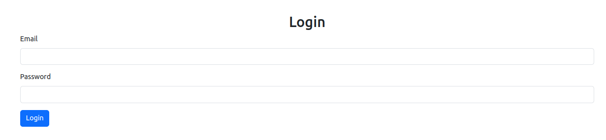
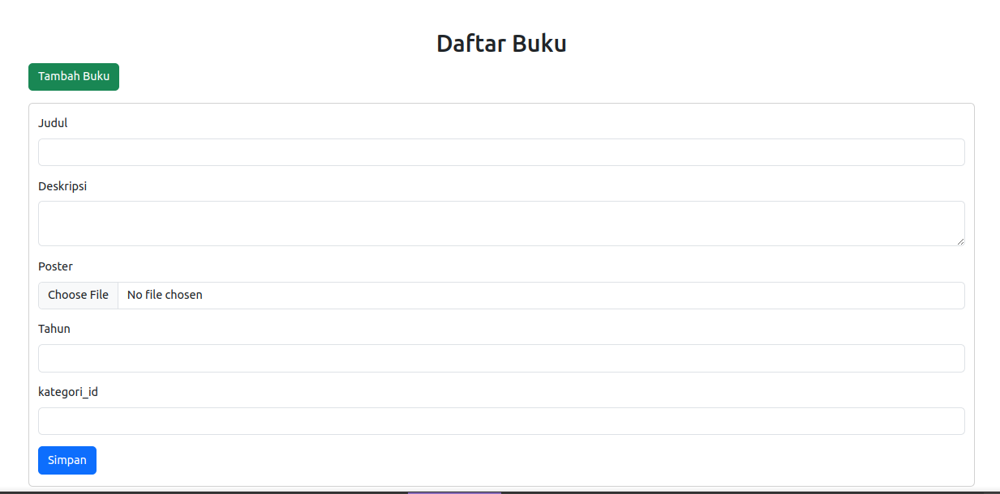
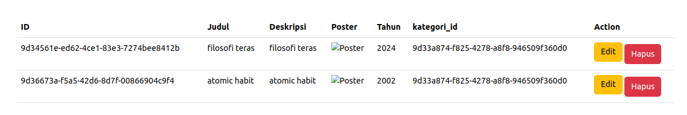
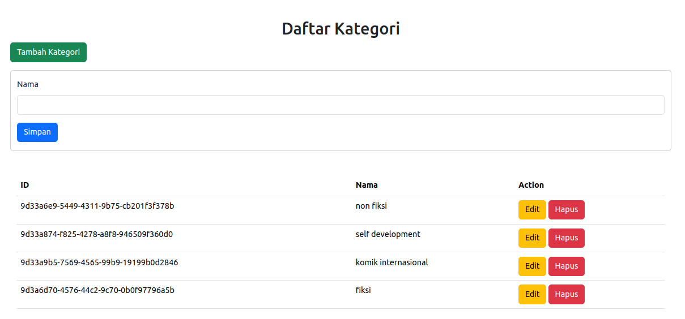
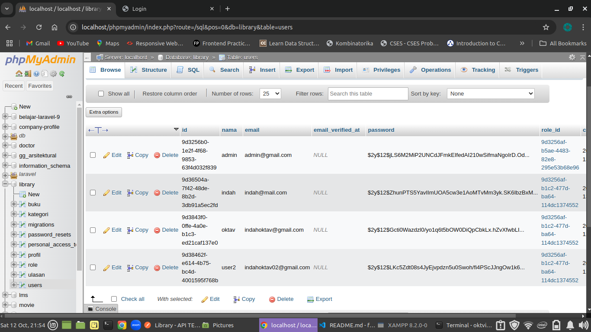
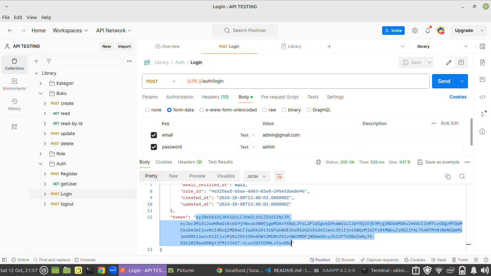
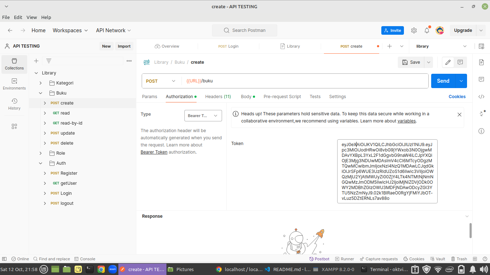
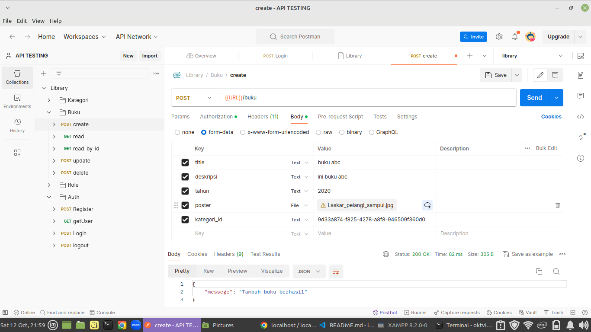

## A. Penjelasan Project

Nama Project: Website Library Sederhana
Teknologi: Laravel 10, MySQL, Blade Templating, JWT (JSON Web Token) untuk autentikasi.

Project ini adalah website perpustakaan sederhana yang dibuat menggunakan Laravel 10 dengan MySQL sebagai database. Fitur utama mencakup manajemen buku, kategori, pengguna, dan ulasan. Pada project ini, hanya admin yang memiliki akses untuk melakukan CRUD (Create, Read, Update, Delete) buku, yang diatur melalui middleware.

Fitur autentikasi menggunakan JWT untuk memastikan keamanan akses. Sistem mendukung registrasi, login, dan logout. Setiap endpoint API diuji menggunakan Postman untuk memastikan fungsionalitas yang tepat.

## B. Desain Database

Entitas yang Digunakan:

1. User - Menyimpan informasi pengguna.
2. Role - Menyimpan informasi peran pengguna (misalnya admin, user biasa).
3. Profil - Menyimpan detail tambahan untuk setiap pengguna.
4. Buku - Menyimpan informasi terkait buku di perpustakaan.
5. Kategori - Menyimpan informasi kategori buku. Relasi dengan buku adalah one to many.
6. Ulasan - Menyimpan ulasan dari pengguna terkait buku.

Relasi:
One-to-Many antara Kategori dan Buku, di mana satu kategori bisa memiliki banyak buku.

## C. Screenshot Aplikasi

Login

CRUD Buku

CRUD Kategori Buku

Database

Pengujian endpoint di POSTMAN

## D. Dependency

Berikut adalah beberapa dependency yang digunakan dalam project ini:

Laravel Framework: versi 10
MySQL: untuk menyimpan data perpustakaan.
JWT (JSON Web Token): digunakan untuk autentikasi dan manajemen token user.
Postman: untuk pengujian endpoint API.
Blade Templating: untuk mengelola tampilan frontend, terutama untuk admin panel.

## Documentasi API dengan POSTMAN

https://documenter.getpostman.com/view/28023599/2sAXxQcWym
